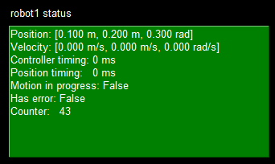
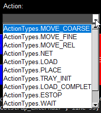

# Master
This is the top level 'Master' software for controlling the Domino Robot System. It is the central hub for communication and control of all other robots, provides a GUI for visualization and debugging, and handles executing the top level plan to set up all the dominos.

There are two programs that can be run within the master software:
- `MasterMain.py` is the main program that runs the GUI and controls everything and is the one the rest of this README will primarily focus on.
- `FieldPlanner.py` will generate a plan using an input image, available domino colors, and many other configuration parameters (all defined in `config.py`). This plan can then be saved to a file (in the `src/master/plans/` folder) and loaded at a later point for execution. You probably shouldn't ever need to run this.

# Table of Contents
<!-- TOC -->

- [Master](#master)
- [Table of Contents](#table-of-contents)
- [Installation](#installation)
- [Usage](#usage)
    - [Robot Setup](#robot-setup)
    - [Running MasterMain](#running-mastermain)
    - [Using the MasterMain GUI](#using-the-mastermain-gui)
        - [Window Overview](#window-overview)
        - [Running Commands](#running-commands)
        - [Summary of available commands](#summary-of-available-commands)

<!-- /TOC -->

# Installation

1. Ensure you have a version of Python 3 installed by installing from https://www.python.org/. This project was developed using Python 3.7, but any recent Python version should be fine. I've only used it on Windows 10 so the instructions here are for Windows. It may or may not work on other operating systems.
2. Open a new terminal window and navigate to the folder where you downloaded the DominoRobot repository
```
cd path\to\DominoRobot
```
3. Create a python virtual environment in the DominoRobot folder
```
python -m venv venv
```
4. Activate the virtual environment (your terminal should show `(venv)` at the front of the line to indicate it is active):
```
.\venv\Scripts\activate
```
5. Install required python packages in the virtual environment:
```
pip install -r src\master\requirements.txt
```

# Usage

## Robot Setup
Any robot you wish to connect to and control must be setup and running before the master program can do anything.
1. Ensure you are connect to the DominoNet wifi. Talk to Alex if you need help getting setup on the network.
2. Power on the robot by plugging in both sets of batteries and turning on all power switches. You can leave the hardware ESTOP button pressed for now while finishing the setup, but just make sure you release it before trying to send movement commands or it won't go anywhere!
3. Connect to the robot over SSH.
    - If this is your first time using SSH, you may need to install an SSH program like [PuTTY](https://www.putty.org/) or setup [Windows SSH](https://www.pugetsystems.com/labs/hpc/How-To-Use-SSH-Client-and-Server-on-Windows-10-1470/)
    - Figure out the IP address of the robot you are interested in connecting to (If this list becomes out of date, the up to date info will be in the `ip_map` variable in `config.py`)
    
    | Target        | IP           |
    |---------------|--------------|
    | robot1        | 192.168.1.5  |

    - SSH to `pi@<ip_addr>` and enter the password to connect

4. Once you are connected to the robot move to the DominoRobot directory:
```
cd DominoRobot
```
5. Ensure that the robot has the latest version of the correct software
```
git checkout master && git pull
```
6. Recompile the robot software (this could take a minute or two if it has to compile a lot of stuff)
```
make
```
7. Start the robot software
```
run_robot
```
8. This should start printing out a bunch of info on the screen and the robot should be ready to connect to the master (See the next section on [Running MasterMain](#running-mastermain) ). Note that you must keep this terminal window running as closing it will stop the robot software. If at any point you want to stop the software, just use `Ctrl+C` to stop it. You can then restart it with `run_robot` again.
9. **IMPORTANT**: When you are done and want to shut everything down, make sure you shut down the raspberry pi by running the shutdown command BEFORE turning off the power. If you just turn off the power without shutting down, there is a possibility that the SD card can get corrupted.
```
sudo shutdown -h now
```

## Running MasterMain
1. Open a new terminal window and navigate to the folder where you downloaded the DominoRobot repository (if you aren't there already from the installation step)
```
cd path\to\DominoRobot
```
2. Ensure that your virtual environment is active (your terminal should show `(venv)` at the front of the line to indicate it is active):
```
.\venv\Scripts\activate
```
3. Run the program:
```
python src\master\MasterMain.py
```
4. It may take a second for the window to show up, but as long as a window pops up and the commandline doesn't spit out a bunch of errors, you should be good to go. You can stop the program at any time with the X in the top right of the window, or using `Ctrl+C` on the commandline.
5. If you need to stop and re-run the program, you only need to re-run step 3 above as long as you don't close the terminal window (In most terminals you can just push the up arrow to get back the previous command you ran).

## Using the MasterMain GUI
### Window Overview
The window will look something like this when you launch it:


On the left are the status panels for each component connected to the system. They are all red right now because nothing is connected and will turn green and display information when that component is active, like this:



In the middle is a display that shows where the robot and other objects are in the scene. As components are connected and move around, this will update to show their location. On the bottom of the middle section are the control buttons which is your main way of interacting with the system:


On the right side of the window, the program prints out information about what it is doing. This information is also mirrored to the console and logged into `DominRobot\log\master.log` (which is overwritten on each new run)

### Running Commands
In order to send a command to a robot a few prerequisites must be met. 

1. The robot has to be connected to the master (i.e. the box should be green and the counter value should be changing). If you followed the [setup](##robot-setup) steps above, this probably should be the case as soon as you run `MasterMain` on your computer. If not, you'll have to debug why (check that your SSH connection is okay and that the robot program hasn't crashed)
2. The robot is programmed to only run a single command at a time, so it will ignore any commands that are sent while another one is active, so make sure a previous command isn't still running. If there is no motion from the robot/lifter and the "Motion in progress" value is False, it should let you run a command.

To actually run the command, you need 3 pieces of information.
1. The `Target` field is which robot/device to send the command to. Make sure you have the right target selected from the drop down menu.


2. The `Action` field is which action you would like to run on the target. See below for a summary of what the various actions do.



3. Some actions require some additional data to be specified. If additional data is needed for an action, you must specify it in the `Data` field by typing it in. See the table below for which actions require additional data. If an action does not require additional data any information (blank or otherwise) in the data field is ignored.

Once all the prerequisites are met and the required fields are filled in, you may use the `<Enter>` key or the `Send Command` button to run the command on the target. If everything is successful, you will see values change in the status panel of the target and text printed out in the pane on the right. 

If something goes wrong, you can use the big red ESTOP button on the command window to send an emergency stop signal to all robots. Note that this is a software ESTOP and requires the master to be functional enough to send the ESTOP signal and the target functional enough to recieve and act on the ESTOP signal. There are certian failure modes where this will not be the case and this button will not function (i.e. the master software crashes and you can't push the button). In that case, use the physical ESTOP buttons on the robots to cut power.

### Summary of available commands

| Name  | Valid targets | Summary | Additional data|
|-------|---------------|---------|----------------|
|MOVE_COARSE | robot | Move the robot coarsely to an absolute position. | Comma separated x,y,a pose (Example: `1.0,2,0` would tell the robot to move to x=1, y=2, a=0). Units are meters, meters, radians. | 
|MOVE_FINE | robot |  Move the robot very precisely to an absolute position.| Comma separated x,y,a pose (Example: `0.1,-0.5,3.14` would tell the robot to move to x=0.1, y=-0.5, a=3.14). Units are meters, meters, radians.|
|MOVE_REL | robot |Move the robot coarsely to a position relative to its current position.|Comma separated x,y,a pose (Example: `1.0,2,0` would tell the robot to move to x=x_current+1, y=y_current+2, a=a_current+0). Units are meters, meters, radians. |
|MOVE_CONST_VEL |robot | Move the robot coarsely at a constant velocity for a specified time.|Comma separated x,y,a,t velocity and time (Example: `0.1,0.2,0,4` would tell the robot to move to at a velocity of x_vel=0.1, y_vel=0.2, a_vel=0 for t=4 seconds). Units are meters/sec, meters/sec, radians/sec, seconds. |
|NET | all |Check if the robot is connected to the network. | None |
|LOAD| robot | Run the tray loading sequence on the robot. *Note that the tray will pause in the "ready to load" position until a LOAD_COMPLETE action is recieved*.| None |
|PLACE| robot | Run the tray placement sequence on the robot.| None|
|TRAY_INIT | robot | Run the tray intialization sequence on the robot. | None|
|LOAD_COMPLETE|robot| Indicate to the robot that the base station has completed the loading process. | None |
|ESTOP|all| Tell the target to immediately stop any current action/motion. | None |
|WAIT|N/A| Not yet implimented. | N/A|
|CLEAR_ERROR |all| Clear an error state that is preventing the target from starting a new action.| None |
